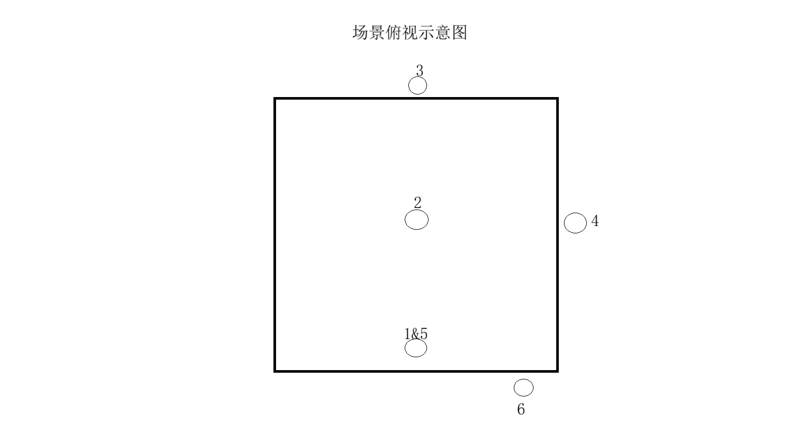

# 实验环境与硬件配置说明

## 文档综述
本数据集采集了包含60GHz毫米波雷达、77GHz毫米波雷达、Wi-Fi感知信道状态信息以及摄像头视频在内的多模态数据，旨在为人体动作识别相关研究提供数据支持。关于各类数据的具体技术细节、格式说明及处理方法，请参阅各自数据目录下的 `readme` 文件。本文档主要侧重于阐述实验的场景布置、硬件配置以及所执行动作的详细规范。

## 版权声明与使用许可

本数据集采用**知识共享署名 4.0 国际许可协议（CC BY 4.0）**进行许可。使用者可以：
- **共享** — 在任何媒介以任何形式复制、分发本数据集
- **改编** — 修改、转换或以本数据集为基础进行创作

只要遵守以下条件：
- **署名** — 您必须给出适当的署名，提供指向本许可协议的链接，并标明是否（对原始作品）作了修改。您可以用任何合理的方式来署名，但不得以任何方式暗示许可人为您或您的使用背书。

完整协议文本请参阅：https://creativecommons.org/licenses/by/4.0/deed.zh

## 环境条件

| 参数 | 数值/描述 |
|------|-----------|
| **测试地点** | 上海市闵行区园美路109号上海市养老科技产业园研发测试公共服务平台 |
| **场景类型** | 室内开放环境，在室内中间划定4m×4m活动区域，天花板高度3m |
| **干扰类型** | 无干扰 |
| **环境温度** | 23.5摄氏度 |
| **环境湿度** | 45% |
| **光源类型** | 自然光 |

## 实验硬件配置

### 雷达配置
| ID | 类型 | 位置 | 高度(cm) |
|----|------|------|----------|
| 1 | 77GHz毫米波雷达 | 活动区域中心点下侧1.5m处 | 130 |
| 2 | 60GHz毫米波雷达 | 活动区域中心点顶部 | 300 |

### WiFi配置
| ID | 类型 | 位置 | 高度(cm) |
|----|------|------|----------|
| 3 | WIFI主设备 | 活动区域中心点上侧2.15m处 | 130 |
| 4 | ESP32 | 活动区域中心点右侧2.1m处 | 130 |
| 5 | ESP32 | 活动区域中心点下侧1.5m处 | 130 |

### 摄像头配置
| ID | 类型 | 位置 | 高度(cm) |
|----|------|------|----------|
| 6 | 摄像头 | 活动区域中心点下侧2.2m，右侧0.65m处 | 55 |

## 实验环境布局示意图

下方示意图直观展示了上述硬件在测试环境中的布局情况。

<div align=center>

</div>

_图示：活动区域（4m×4m）及各传感设备（雷达、WiFi、摄像头）的安装位置。_

## 测试参与人员

**人员名单：** SYM, WHY, ZZR, SGL, YW, YYC, WXY  
**人员类型编码：** 1

## 运动细节配置

### 动作列表

| 动作ID | 持续时间(s) | 描述 | 重复次数(每人) | 速度模式 |
|--------|-------------|------|---------------|----------|
| **walk** | 5 | 5s直线行走 | 60 | 恒定 |
| **stand** | 5 | 站立 | 60 | - |
| **bend** | 5 | 从直立开始，执行：前屈（手指尽量触地）；左/右侧屈（侧向弯45°）；躯干旋转（扭转60°）动作过程控制在1.5–2秒，缓慢完成，突出躯干角度变化 | 60 | - |
| **sweep** | 5 | 测试者手持扫把在范围内进行扫地动作，活动范围约2–3m。姿态特征：身体保持前倾但未倒地；动作幅度：上下肢自然摆动，躯干基本稳定；要点：模拟低位弯腰工作，强调动态非跌倒状态 | 60 | - |
| **jump** | 5 | 测试者原地站立后完成，动作要干净利落，起跳与落地清晰，控制单次动作周期在1秒以内。高度以30–50cm为宜 | 60 | - |
| **sit** | 5 | 从站立开始，控制从站立到坐稳的全过程在0.8–2.5秒，强调髋部高度快速降低 | 60 | - |
| **fall_forward** | 5 | 手臂自然前伸，胸口朝地着地，测试者直立站好，模拟被绊或突然失去重心，迅速在2秒内跌倒 | 60 | - |
| **fall_aside** | 5 | 测试者从站立位置向左或右侧迅速失衡侧倒，2秒内完成动作，倒地后静止。动作顺序：一侧踝关节失稳 → 膝部带动 → 侧臀/大腿外侧着地；要点：强调侧倾与翻转动作的清晰性，动作节奏快但不可摔伤；头部自然偏转避地 | 60 | - |
| **heart_fall** | 5 | 测试者从站立开始，先用左手捂住胸口，同时右臂外展模拟放射性疼痛，呈现不适状态。表现为缓慢支撑、呼吸急促。之后突然失去支撑平衡，整个人向后或侧方缓慢倒地（2秒内完成），最终仰卧或侧卧。强调上肢动作变化与倒地姿态连续性 | 60 | - |
| **stand_fall** | 5 | 测试者先坐在凳子上，随后尝试站起，在起身后约2–3秒内表现出头晕、重心不稳的状态。膝盖会反复弯曲、抖动，尝试稳定身体。最终由于支撑失败而前倾或后仰倒地，倒地过程偏缓，重心缓慢下坠。整个动作持续3–4秒，有明显的缓冲与失败尝试阶段 | 60 | - |
| **fall_squat** | 5 | 测试者从沙发边起身，模拟头晕或滑脚，重心失控跌倒，动作在5秒内完成。要求：起身动作真实，跌倒自然连接 | 60 | - |
| **fall_backward** | 5 | 重心后仰，臀部着地，双手略张缓冲，头部避免接触地面。测试者直立站好，模拟被绊或突然失去重心，迅速在2秒内跌倒。要点：全过程突然，控制不住身体平衡；保持摔倒姿势不动，便于检测静态异常状 | 60 | - |

---
```
如有关于此数据集的疑问、反馈或法律咨询，请通过以下联系方式与维护者联系：`weiyao@mail.sim.ac.cn`
```
